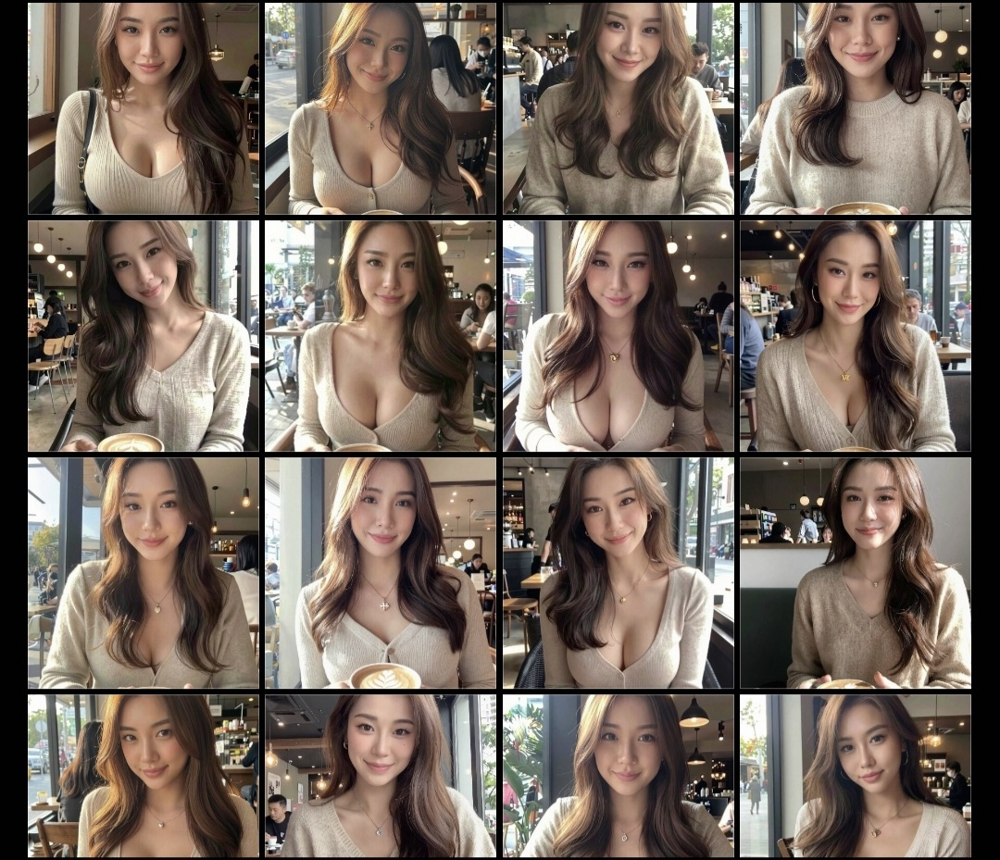
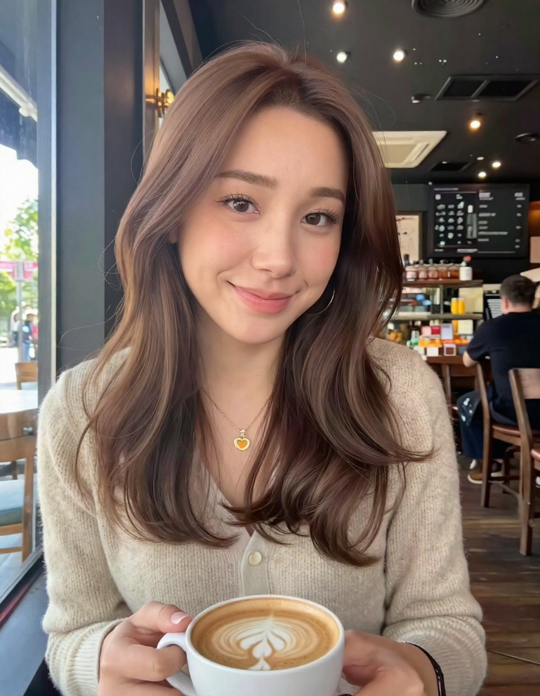

I've been building AI image generation workflows for a while now. Training LoRAs, comparing checkpoints, wiring up ComfyUI nodes.

And the whole time, I kept needing to look up the same terms. **What's the difference between CFG and Denoise?** Why does everyone say "safetensors"? What even is a VAE?

So I wrote the dictionary I wish existed when I started.

This isn't a tutorial. It's a **reference**. Bookmark it. Come back when you hit a term you don't recognize. Everything is organized in layers — from "I just heard about Stable Diffusion" to "I'm training my own models."

---

## Layer 1: The Absolute Basics

### Stable Diffusion (SD)

An **open-source AI image generator**. You type a description of what you want, and it creates an image.

Similar to MidJourney or DALL-E, but with one massive difference: **you run it on your own machine**. No subscription. No content filters. No one else's rules.

### Prompt

The text instruction you give the AI. The more detailed, the better.

- **Prompt:** "a Japanese woman in a white dress standing under cherry blossoms, golden hour lighting"
- **Negative prompt:** what you *don't* want — "blurry, deformed hands, low quality"

Think of it as giving directions to a painter. Vague directions get vague results.

### ComfyUI

The interface you use to operate Stable Diffusion. It's a **node-based visual workflow** — you connect function blocks together like a flowchart.

The other common interface is **WebUI (A1111)**, which is simpler but less flexible.

**ComfyUI is where the SD community is heading.** Most new tools and workflows are built for it.

---

## Layer 2: The Model Zoo

This is where it gets interesting. Open CivitAI and you'll see dozens of model types. Here's what each one actually does.

### Checkpoint (Base Model)

**The single most important thing in Stable Diffusion.**

A checkpoint is the AI's trained "brain." It determines the fundamental style and capability of every image you generate.

- Files are big — typically **6–12 GB**
- Examples: Z-Image Turbo (ZIT), Flux, SDXL
- Different checkpoints = completely different art styles

**Analogy:** A checkpoint is a fully trained painter. One painter does photorealism. Another does anime. You pick the painter first, then give them instructions.

### How Checkpoints Are Made

| Method | What it means |
|--------|--------------|
| **Trained** | Built from scratch or fine-tuned from a base model. Requires serious GPU time |
| **Merged** | Two or more checkpoints mathematically blended together. No GPU training needed |

Merged checkpoints are surprisingly effective. For example, **Moody Real Mix** blends multiple ZIT models to get a more photorealistic look — no training required.

### LoRA (Low-Rank Adaptation)

A **small plugin** that teaches an existing checkpoint something new.

Want the AI to generate a consistent character? Train a LoRA on that character's face. Want a specific art style? There's probably a LoRA for that.

- Files are small — **tens to hundreds of MB**
- Swap them in and out freely
- Must match the base checkpoint (a ZIT LoRA won't work on Flux)

**Analogy:** If the checkpoint is the painter, the LoRA is a stack of reference photos you hand them. "This is what this person looks like. Now paint them in different scenes."

### LyCORIS / LoKR / DoRA

Variants of LoRA that use different math under the hood.

| Name | What it is |
|------|-----------|
| **LoKR** | Uses Kronecker products. Sometimes better for specific use cases |
| **DoRA** | Newer variant. Potentially higher quality, but slower |
| **LyCORIS** | A framework that includes LoHa, LoKR, and other variants |

**Practical advice:** Standard LoRA works great for most people. Don't worry about these unless you're deep into training experiments.

### VAE (Variational Autoencoder)

The AI doesn't paint pixels directly. It works in a compressed mathematical space, then the **VAE translates that math back into a visible image**.

Different VAEs affect color and brightness. Most checkpoints come with a built-in VAE, but you can swap them.

**Analogy:** The checkpoint paints the picture. The VAE develops the film.

### Embedding (Textual Inversion)

A tiny file that teaches the AI a specific concept.

Smaller and simpler than LoRA, but also more limited. The most common use is **negative embeddings** — like a "bad-hands" embedding that tells the AI what ugly hands look like so it avoids them.

**Analogy:** If LoRA is a photo album, an embedding is a sticky note.

### Hypernetwork

An older method for fine-tuning models. **Mostly replaced by LoRA.** You'll see it mentioned in old tutorials, but you can safely ignore it.

### Aesthetic Gradient

Another older technique for teaching the AI what "good-looking" means. Rarely used in 2026.

### ControlNet

Gives you **precise control over composition**.

Draw a stick figure pose → the AI generates a realistic person in that exact pose. Feed it an edge map → the AI fills it in with detail.

| ControlNet Type | What it controls |
|----------------|-----------------|
| **OpenPose** | Body pose and hand position |
| **Canny** | Edge lines and outlines |
| **Depth** | 3D depth of the scene |
| **Tile** | Preserves existing detail while upscaling |

**Analogy:** The checkpoint is the painter. ControlNet is you physically posing the model before the painter starts.

### Upscaler

Takes a small AI-generated image and **enlarges it with added detail**.

AI typically generates at 1024×1024. Upscalers can push that to 2048 or beyond — and they actually add detail rather than just stretching pixels.

### Motion Models

For **video generation**. AnimateDiff turns static images into short animations. WAN 2.1 is a dedicated video generation model.

This space is evolving fast.

### Wildcards

Random substitution in prompts.

`{red|blue|green} dress` → randomly picks a color each time. Great for **batch-generating variations** without manually changing the prompt.

### Poses

Pre-made body position data for ControlNet. Think of them as pose presets.

### Detection Models

Models that find specific things in images. Example: `face_yolov8m.pt` detects face positions.

Used for **inpainting** (redrawing just the face) or face swap workflows.

### Workflows

ComfyUI's **saved configurations** (JSON files). Someone shares a workflow, you import it, and their entire node setup appears in your editor.

This is one of ComfyUI's killer features — you can share and reproduce exact generation pipelines.

---

## Layer 3: File Formats

Not all model files are created equal.

| Format | Extension | Safety | Status |
|--------|-----------|--------|--------|
| **SafeTensors** | `.safetensors` | Safe — cannot contain executable code | **Current standard. Use this.** |
| **PickleTensor** | `.pt`, `.ckpt` | Unsafe — can contain malicious Python code | Legacy. Avoid if possible |
| **GGUF** | `.gguf` | Safe | New. Smart compression from the LLM world |
| **Diffusers** | (folder) | Safe | HuggingFace's format. Multiple small files |
| **Core ML** | `.mlmodelc` | Safe | Apple Silicon only |
| **ONNX** | `.onnx` | Safe | Cross-platform but rare in SD |

### The Important Ones

**SafeTensors** is the only format you should download. Period. If a model is only available as `.ckpt`, make sure you trust the source.

**GGUF** is worth watching. It brings smart compression from the LLM world — keeping important weights at high precision while compressing less critical ones. This lets lower-VRAM GPUs run bigger models with less quality loss than traditional quantization.

---

## Layer 4: Precision (What FP16 / FP8 / BF16 Mean)

Every number in a model is stored at a certain **precision** — how many bits represent each value. More bits = more accurate = bigger file = more VRAM.

| Precision | Bits | File Size | Quality | Who uses it |
|-----------|------|-----------|---------|-------------|
| **FP32** | 32 | Huge | Perfect | Almost nobody. Way too large |
| **FP16** | 16 | Half of FP32 | Excellent | **The standard for inference** |
| **BF16** | 16 | Same as FP16 | Excellent | **Better for training** |
| **FP8** | 8 | Half of FP16 | Very good | For VRAM-limited GPUs (e.g., 24GB cards) |

### Quantization

The process of converting a model from higher precision to lower precision.

FP16 → FP8 = quantization. You save VRAM at the cost of slightly reduced quality.

**Analogy:** FP16 is the original photo. FP8 is a high-quality JPEG. You can tell the difference if you zoom in, but for most purposes it's fine.

---

## Layer 5: Generation Settings

These are the numbers you tweak every time you generate an image. Understanding them is the difference between random results and intentional ones.

### CFG (Classifier-Free Guidance)

Controls **how strictly the AI follows your prompt**.

The AI runs two parallel paths: one guided by your prompt, one completely unguided. CFG is the blend ratio.

| CFG Value | Behavior |
|-----------|----------|
| **1** | Almost no guidance. The AI does whatever it wants |
| **5–7** | Balanced. Follows your direction but has creative freedom |
| **10–12** | Strict. Closely matches your prompt |
| **15+** | Over-constrained. Images become oversaturated and distorted |

**Why do some models use CFG 1?** Distilled models (like ZIT Turbo) already "know" what to paint. They don't need guidance — the knowledge is baked in. Regular models need CFG 5–12 to be pushed in the right direction.

**Analogy:** CFG is the **volume of your voice** when talking to the painter. Whisper (low CFG) = "paint whatever you feel." Shout (high CFG) = "exactly what I said, nothing else."

### Steps

The AI doesn't generate an image in one shot. It starts with pure noise and **removes a little noise each step**.

More steps = more refinement. But there's a ceiling — after a certain point, more steps don't help.

| Model type | Typical steps |
|-----------|---------------|
| **ZIT Turbo (distilled)** | 8 steps |
| **Regular models** | 20–50 steps |
| **Flux Klein** | ~28 steps |

### Sampler

The algorithm that decides **how to remove noise at each step**.

| Sampler | Personality |
|---------|------------|
| **Euler** | Simple, fast, reliable. Great starting point |
| **Euler a** | Euler + randomness. More variety between generations |
| **DPM++ 2M** | Looks back at previous steps to adjust. Stable and high quality |
| **DPM++ 2M Karras** | DPM++ with Karras scheduling. Better detail. Popular with SDXL |
| **DPM++ SDE** | Adds random perturbation. More artistic feel |
| **res_multistep** | Designed for distilled/turbo models. Multiple micro-adjustments per step |

Don't overthink it. **DPM++ 2M Karras** is a safe default for most models.

### Scheduler

If the sampler decides *how* to walk, the scheduler decides **how far to walk each step**.

You need to reduce noise from 100% to 0% over N steps. How do you distribute that?

| Scheduler | Strategy |
|-----------|----------|
| **Simple/Linear** | Equal steps: 100 → 97 → 94 → 91... Even and predictable |
| **Karras** | Big steps early, tiny steps late. Rough in fast, then refine detail |
| **Beta** | Like Karras but more aggressive. Biggest steps in the middle |
| **Exponential** | Exponential decay |

**Why does ZIT use Simple?** With only 8 steps, there's no room for fancy scheduling. Just split it evenly and go.

**Karras** is the default for most non-distilled models — the "sketch first, refine later" approach makes sense when you have 30+ steps to work with.

### Seed

A random number that determines the **starting noise pattern**.

- Same seed + same settings = identical image
- Different seed = completely different image

**Important caveat:** Seeds don't guarantee consistency across different prompts. Change the prompt and the face changes — even with the same seed.

### Denoise Strength

Only used in **img2img and inpainting** (when you already have an image).

Controls how much of the original image to keep vs. how much to regenerate.

| Denoise | What happens |
|---------|-------------|
| **0.0** | No change at all. Pointless |
| **0.2–0.3** | Minor touch-ups. Fix lighting, small details |
| **0.4–0.5** | Moderate changes. Face swaps, hair color changes |
| **0.6–0.7** | Major changes. Only the rough composition survives |
| **0.8–1.0** | Basically a new image. Original is just a loose reference |

**Analogy:** Denoise is the **size of the eraser** you hand the painter. Small eraser = fix a detail. Big eraser = wipe the canvas and start over.

### CFG vs. Denoise — The Most Confusing Pair

These two get mixed up constantly. Here's the difference:

| | CFG | Denoise |
|---|-----|---------|
| **Controls** | How much the prompt matters | How much of the original image to keep |
| **Used in** | All generation | Only img2img / inpainting |
| **High value =** | Follows prompt strictly | Changes more of the image |
| **Low value =** | AI has creative freedom | Preserves the original |

### Resolution

The pixel dimensions of your output. Common sizes:

- **1024×1024** — Square, general purpose
- **896×1152** — Portrait orientation, good for people
- **1216×832** — Landscape

Every model has an optimal resolution range. Going too far outside it causes problems (weird proportions, repeated patterns).

---

## Layer 6: Distilled vs. Non-Distilled Models

This is the concept that unlocks why some models are 10× faster than others.

### What Is Distillation?

A regular model needs 30–50 steps to generate an image. Each step is a full computation cycle. That's slow.

**Distillation** trains a smaller "student" model to replicate a larger "teacher" model's results — but in far fewer steps.

It's like studying for an exam. The teacher solves problems in 50 careful steps. The student watches the teacher, learns the shortcuts, and arrives at the same answer in 8 steps.

### The Comparison

| | Non-Distilled (Original) | Distilled (Turbo/Schnell/Lightning) |
|---|---|---|
| **Steps** | 20–50 | 4–8 |
| **Speed** | Slow | 3–10× faster |
| **Quality** | Highest (theoretically) | Very close. Sometimes slightly lower |
| **CFG** | Needs 5–12 | Usually just 1 (guidance baked in) |
| **Flexibility** | High — lots of knobs to turn | Low — use the recommended settings |
| **LoRA training** | Straightforward | Needs a Training Adapter (de-distillation) |

### Common Pairs

| Teacher (Original) | Student (Distilled) |
|---|---|
| Z-Image Base (ZIB) | **Z-Image Turbo (ZIT)** |
| Flux.1 Dev | Flux.1 Schnell |
| SDXL Base | SDXL Turbo / SDXL Lightning |

### Why Is LoRA Training Harder on Distilled Models?

Distillation compresses the model. Training a LoRA directly on a compressed model breaks its few-step inference ability.

The solution: a **Training Adapter** that temporarily "decompresses" the model during training. Once training is done, you throw away the adapter — the LoRA works with the distilled model just fine.

### Which Should You Choose?

- **Need speed?** → Distilled. A few seconds per image. Great for iteration and batch work
- **Need maximum quality?** → Non-distilled. Slower, but potentially better
- **Best approach?** → Use both. Distilled for quick drafts and exploration. Non-distilled for final polished output

---

## Layer 7: Base Model Families

These are the "platforms" of the SD world. Like choosing between iOS and Android — each has its own ecosystem.

### The Major Players (Early 2026)

| Family | Developer | Strengths | Status |
|--------|-----------|-----------|--------|
| **Z-Image (ZIT/ZIB)** | Alibaba Tongyi | Ultra-fast (8 steps), excellent at Asian faces | Rising star |
| **Flux** | Black Forest Labs | Highest quality, great text rendering | Most popular right now |
| **SDXL** | Stability AI | Largest ecosystem, most LoRAs available | Mature but being surpassed |
| **SD 1.5** | Stability AI | Oldest, tons of resources | Legacy. Still alive, barely |

### Others You Might Encounter

- **Hunyuan** — Tencent. Big in the Chinese market
- **HiDream** — Newer open-source entry
- **Chroma** — Community fork of Flux
- **CogVideoX** — Video generation model
- **Aura Flow** — Smaller open-source model

### Why So Many?

Every major AI lab is training their own base model. It's like smartphones — iPhone, Samsung, Pixel all do the same thing differently.

**Critical point:** LoRAs are locked to their base model family. A ZIT LoRA won't work on Flux. An SDXL LoRA won't work on ZIT. Always check compatibility.

---

## Layer 8: Advanced Operations

### txt2img (Text to Image)

The fundamental operation. Type a prompt → get an image. Where everyone starts.

### img2img (Image to Image)

Feed the AI an existing image plus a prompt → it modifies the image based on your instructions. Use **denoise strength** to control how much changes.

### Inpainting

Select a region of an image with a mask → the AI **redraws only that region**.

Perfect for fixing faces, changing outfits, or removing unwanted elements while keeping everything else intact.

### Outpainting

Extend an image beyond its borders. A half-body portrait → outpaint into a full-body shot.

### Face Swap / Head Swap

Replace one person's face with another. The current best approach on many models: **inpainting + LoRA**.

### IP-Adapter

Use a reference image to guide generation — no LoRA training required. Hand it a photo and say "generate in this style" or "generate this person."

**Caveat:** Not supported on all base models. Works with SDXL and SD 1.5 but not ZIT (as of early 2026).

### Virtual Try-On

Give the AI a person photo + a clothing photo → it outputs the person wearing that outfit.

Flux Klein has a dedicated Try-On LoRA that works surprisingly well.

---

## Layer 9: Training

### LoRA Training

Teaching the AI to recognize a new person, object, or style.

| Requirement | Details |
|------------|---------|
| **Training images** | 15–25 high-quality photos |
| **Captions** | A `.txt` file per image describing the content |
| **GPU** | 20–32 GB VRAM recommended |
| **Time** | A few hours depending on hardware |
| **Tools** | Ostris AI Toolkit, kohya-ss |

### Trigger Word

A special keyword set during training. Include it in your prompt to activate the LoRA.

Example: You train a LoRA for a character called Hana using the trigger word `hfujisawa`. When you put `hfujisawa` in your prompt, the AI knows to use that LoRA's learned features.

### Training Adapter

Required for training LoRAs on **distilled models** (like ZIT Turbo).

Distilled models are compressed. Training directly on them breaks their fast-inference ability. The adapter temporarily "decompresses" the model so training can proceed normally. After training, the adapter is discarded.

### Captions

Every training image needs a `.txt` file describing what's in it.

Format: `trigger_word, character description, scene description`

The AI learns: "When I see this trigger word, it means this person."

### Epoch vs. Steps

| Term | Meaning |
|------|---------|
| **Step** | Processing one training image once |
| **Epoch** | Processing *all* training images once |

Example: 24 images, 3000 steps = 125 epochs.

### Overfitting

Train too long and the AI **memorizes instead of learns**. Every output looks identical to the training data — correct face, but zero variety.

The fix: stop training at the right step count. Always generate test samples during training to catch this.

---

## Layer 10: Hardware

### VRAM (Video RAM)

The memory on your GPU. **The single most important spec for Stable Diffusion.**

- Image generation: ~8–16 GB
- LoRA training: ~20–32 GB
- Not enough VRAM = quantize or crash

### GPU Comparison

| GPU | VRAM | Image Generation | LoRA Training |
|-----|------|-----------------|---------------|
| **RTX 3060** | 12 GB | Barely works | Painful |
| **RTX 3090** | 24 GB | Comfortable | Possible with quantization |
| **RTX 4090** | 24 GB | Fast | Possible with quantization |
| **RTX 5090** | 32 GB | Very fast | Comfortable |

### OOM (Out of Memory)

What happens when your model doesn't fit in VRAM. The process crashes.

**Fixes:** Quantize the model, reduce resolution, close other GPU-hungry applications.

---

## Layer 11: Platforms and Community

### CivitAI — The App Store of Stable Diffusion

The **largest SD community**. Models, images, articles, and cloud generation all in one place.

What you'll find:
- **Free model downloads** — checkpoints, LoRAs, embeddings, everything
- **Image galleries with full settings** — see a great image? Click it and view the exact prompt, seed, model, and settings used. This is a goldmine for learning
- **Cloud generation** — generate images using CivitAI's GPUs (uses Buzz tokens — some free, then paid)
- **Model publishing** — share your own LoRAs, build a following

**Why do people share models for free?**

Same reason people open-source code. Community reputation, the satisfaction of building something useful, and sometimes monetization through Early Access (paid early downloads) or tips.

**Etiquette:** If you use someone's model and like it, leave a rating or comment. Model creators see their download counts — it's what keeps them going.

### HuggingFace — GitHub for AI Models

The **official repository** for AI models.

CivitAI hosts community creations. HuggingFace hosts **official releases**.

- Flux official model → HuggingFace
- Z-Image Turbo official model → HuggingFace
- Someone's custom ZIT LoRA → CivitAI

Also hosts datasets, interactive demos (Spaces), and is where most training tools download base models from.

**Analogy:** HuggingFace is the factory parts warehouse. CivitAI is the custom mod shop.

### ComfyUI Manager

The **plugin marketplace** for ComfyUI. One-click installation of custom nodes, extensions, and tools.

### Other Useful Spots

| Platform | What it's for |
|----------|--------------|
| **Reddit** (r/StableDiffusion, r/comfyui) | Discussion, tutorials, troubleshooting |
| **GitHub** | Source code for tools (ComfyUI itself lives here) |
| **YouTube** | Video tutorials, workflow walkthroughs |
| **Discord** | Real-time help from model/tool communities |
| **Tensor.Art** | Model sharing + cloud generation |
| **LiblibAI** | Chinese market equivalent of CivitAI |

### Where to Start?

CivitAI for community models + inspiration. HuggingFace for official models + training tools. Reddit when you're stuck. These three cover 90% of what you'll need.

---

## Hardware Recommendations for 2026

Alright, the part everyone actually wants to know. **What should you buy?**

### Entry Level: RTX 3060 12GB / RTX 4060 8GB

- **Recommended model:** ZIT Turbo FP8 (All-in-One single file)
- **Why:** 8-step generation fits in 12GB with FP8 quantization
- **Can do:** txt2img, basic img2img
- **Can't do:** LoRA training (not enough VRAM), running Flux
- **Alternative:** Skip the GPU entirely. Use CivitAI's cloud generation

### Mid-Range: RTX 3090 / RTX 4090 24GB

- **Recommended models:** ZIT Turbo (full version) + Flux Klein 9B (FP8)
- **Why:** 24GB handles most models at FP8 precision
- **Can do:** txt2img, img2img, inpainting, LoRA training (with quantization — be patient)
- **LoRA training:** Enable quantization, disable sampling during training. It works, just slower
- **Precision:** Stick with FP8. FP16 may OOM

### High-End: RTX 5090 32GB / RTX Pro 6000

- **Recommended models:** ZIT Turbo BF16 + Flux Klein 9B full + community merges
- **Why:** 32GB means no compromises. Run everything at full precision
- **Can do:** Everything. Generation, training, multi-model workflows
- **LoRA training:** Smooth sailing. ~2 seconds per step
- **Precision:** Full BF16. No quantization needed

### No Dedicated GPU / Laptop / Mac

**Don't run locally.** Use cloud services instead:

| Service | Cost | Notes |
|---------|------|-------|
| **CivitAI On-site Generation** | Free tier + paid | Easiest entry point |
| **Google Colab** | Free GPU tier | Good for experimenting |
| **RunPod / Vast.ai** | Pay per hour | Rent a real GPU when you need it |

Mac M-series can technically run SD, but it's slow. Not recommended for training.

---

## Best Model Picks for 2026

| Use Case | Recommended Model | Why |
|----------|------------------|-----|
| **Fast realistic portraits (Asian faces)** | ZIT Turbo | 8-step generation, excellent with Asian features |
| **Highest quality portraits** | Flux 2 Klein 9B | Quality king. Best text rendering too |
| **Photorealistic quick shots** | Moody Real Mix (ZIT merge) | Community merge. More natural skin tones |
| **LoRA training** | Train on ZIT or Flux | ZIT for speed, Flux for quality |
| **Virtual try-on / outfit swaps** | Flux Klein Try-On LoRA | Currently the best working solution |
| **Video generation** | WAN 2.1 / CogVideoX | Evolving fast. Worth watching |

---

## Getting Started: 5 Steps

1. **Install ComfyUI.** Free, open-source, where the community lives
2. **Download ZIT Turbo AIO (FP8).** One file. 8-step generation. Instant results
3. **Browse CivitAI.** Look at images people have made. Click through to see their settings. This is the fastest way to learn
4. **Don't train a LoRA yet.** Master basic generation first. Training is an advanced skill
5. **Join the community.** r/StableDiffusion on Reddit, ComfyUI Discord. People are helpful — ask questions

The Stable Diffusion ecosystem moves fast. New models drop every week. But the fundamentals in this glossary are stable. Learn these concepts once and you'll be able to pick up any new tool or model that comes along.
